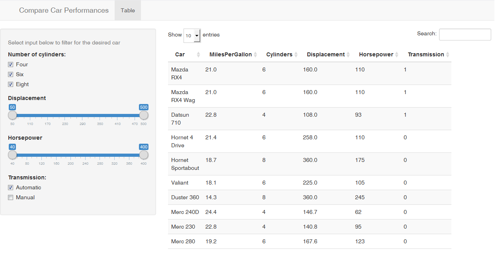
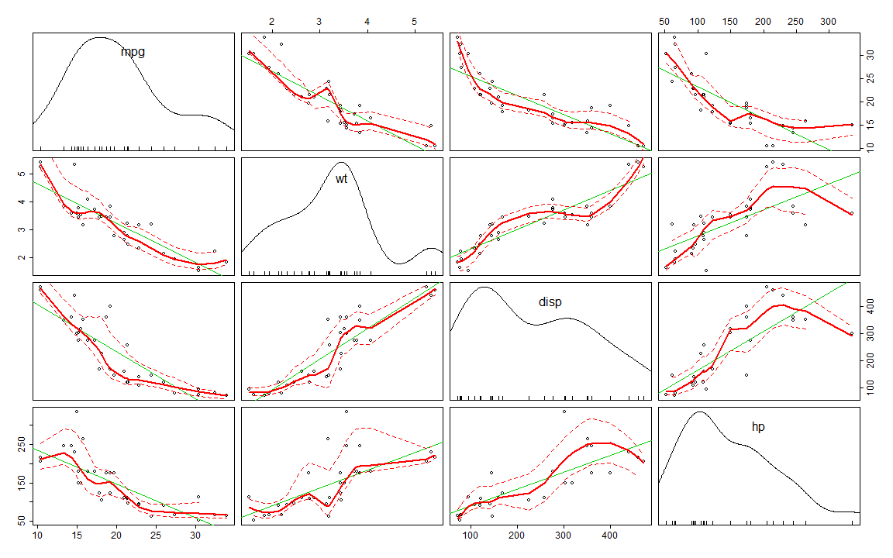

An App to Compare and Search for Car Performances
========================================================
author: Kassem Saleh
date: May 29, 2016
autosize: true

Brief Description of App and Presentation
========================================================

This presentation is done using RStudio Presenter to pitch the idea of the App developed in Part 1 of the Coursera Data Products course. 

The App includes a server file (server.R) and a user interface file (ui.R) to allow the user to:

- Display the content of the data set
- Filter the displayed data using different UI components: sliders, checkboxes, ..
- Sort the displayed data in increasing or decreasing order

The App Interface
========================================================

The interface is divided into two parts:

- The UI for getting inputs is on the left
- The searchable and sorted results are on the right

 

View of the Data on Cars
========================================================
Data used in our App is loaded from the Motor Trend Car Road Tests (mtcars) dataset. Attributes of the data include fuel consumption and ten other features of automobile design and performance for 32 automobiles (1973-74 models). 

- Some initial data in the dataset

```r
head(mtcars)
```

```
                   mpg cyl disp  hp drat    wt  qsec vs am gear carb
Mazda RX4         21.0   6  160 110 3.90 2.620 16.46  0  1    4    4
Mazda RX4 Wag     21.0   6  160 110 3.90 2.875 17.02  0  1    4    4
Datsun 710        22.8   4  108  93 3.85 2.320 18.61  1  1    4    1
Hornet 4 Drive    21.4   6  258 110 3.08 3.215 19.44  1  0    3    1
Hornet Sportabout 18.7   8  360 175 3.15 3.440 17.02  0  0    3    2
Valiant           18.1   6  225 105 2.76 3.460 20.22  1  0    3    1
```

A Scatter Plot Relating Dataset Attributes
========================================================
A scatterplot showing the relationships between  Miles per Gallon (mpg), Weight of the car (w), Displacement (disp) and Horse Power (hp) 



